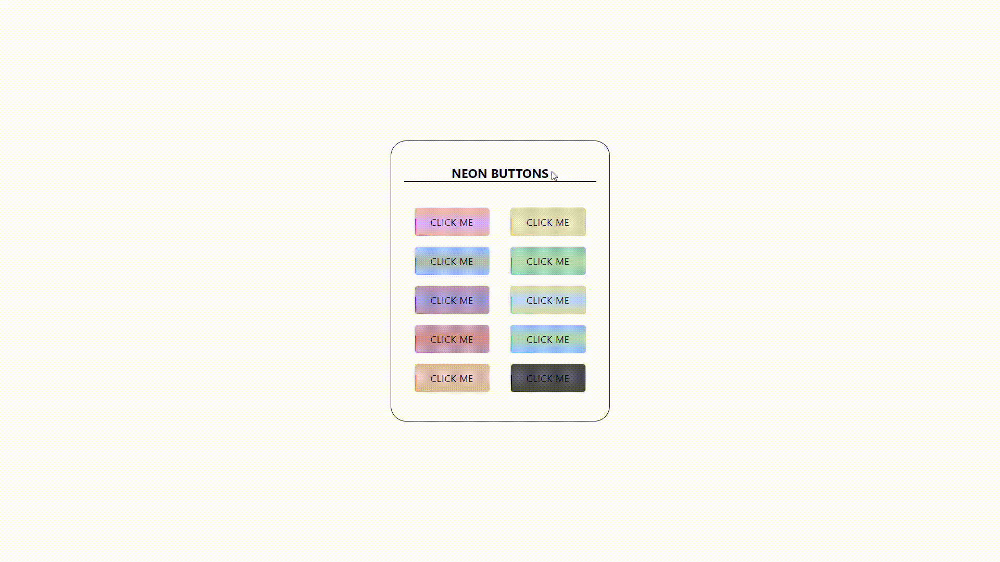

# cryptobcu-react-library

> Colorfull Neon Buttons


[](https://www.npmjs.com/package/cryptobcu-react-library) [](https://standardjs.com)

## Install

```bash
npm install --save cryptobcu-react-library
```

## Usage

```jsx
import React, { Component } from 'react'

import { NeonButton as MyComponent } from 'neon-button-ui'
import 'neon-button-ui/dist/index.css'

class Example extends Component {
  render() {
    return (
      <MyComponent
        type='pink'
        text='Click Me'
        onClick={() => alert("Hello, I'm neon Button...")}
      />
      <MyComponent
        type='blue'
        text='Click Me'
        onClick={() => alert("Hello, I'm neon Button...")}
      />
      <MyComponent
        type='purple'
        text='Click Me'
        onClick={() => alert("Hello, I'm neon Button...")}
      />
      <MyComponent
        type='orange'
        text='Click Me'
        onClick={() => alert("Hello, I'm neon Button...")}
      />
      <MyComponent
        type='yellow'
        text='Click Me'
        onClick={() => alert("Hello, I'm neon Button...")}
      />
      <MyComponent
        type='green-dark'
        text='Click Me'
        onClick={() => alert("Hello, I'm neon Button...")}
      />
      <MyComponent
        type='green-light'
        text='Click Me'
        onClick={() => alert("Hello, I'm neon Button...")}
      />
      <MyComponent
        type='cyan'
        text='Click Me'
        onClick={() => alert("Hello, I'm neon Button...")}
      />
      <MyComponent
        type='black'
        text='Click Me'
        onClick={() => alert("Hello, I'm neon Button...")}
      />
      <MyComponent
        type='red'
        text='Click Me'
        onClick={() => alert("Hello, I'm neon Button...")}
      />
    )
  }
}
```


## License

MIT © [cryptobcu](https://github.com/cryptobcu)
